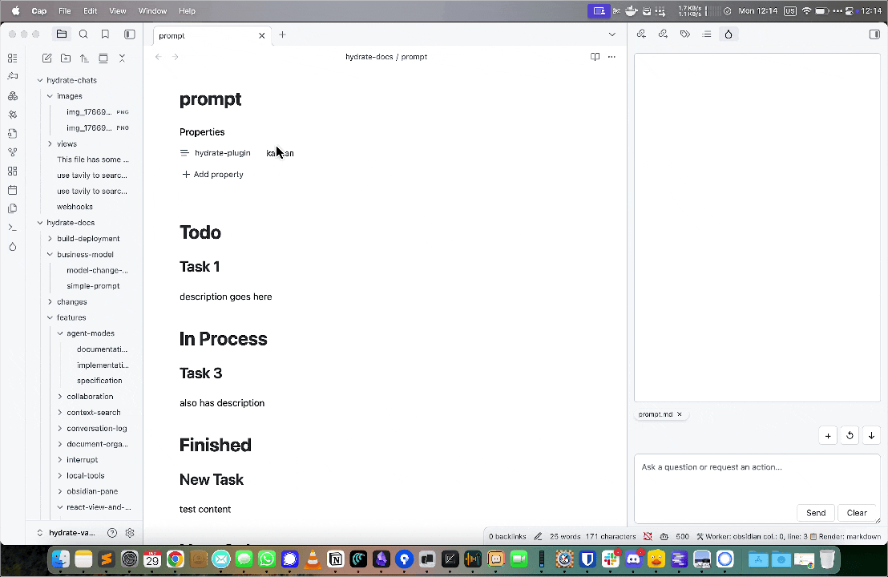
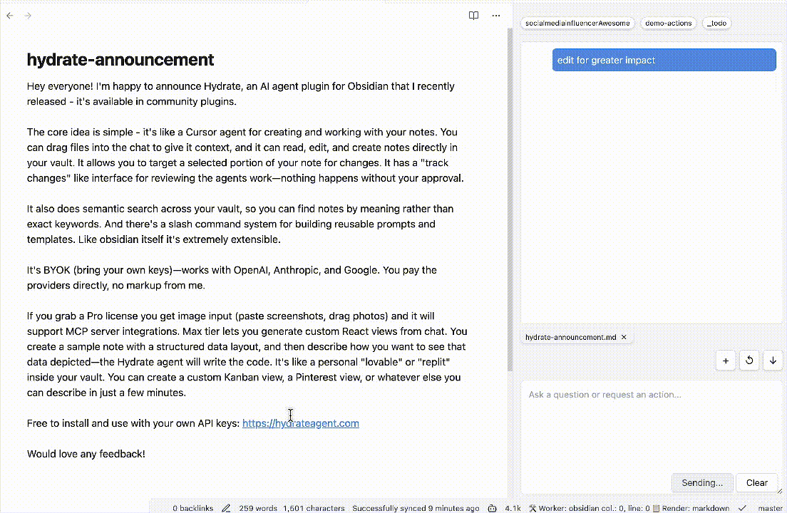

# Hydrate Plugin for Obsidian

**Your AI-powered thinking partner for writing, research, and knowledge discovery in Obsidian.**

---

## ⚠️ Important Disclosures

**Please read these important requirements before installing:**

- **💳 Payment Required:** Full access to Hydrate requires a paid subscription
- **👤 Account Required:** You must create an account to use all features
- **🌐 Network Use:** This plugin connects to remote AI services to provide intelligent features
- **📊 Telemetry:** Anonymous usage analytics are collected to improve the service
- **🔒 Closed Source:** This plugin is Apache 2 licensed, but relies on proprietary server side code for functionality.

### Remote Services Used

Hydrate connects to the following remote services to provide AI-powered features:

- **Hydrate AI Backend:** Processes your queries and provides intelligent responses
- **Third-party AI APIs:** For advanced language processing and content generation
- **Analytics Services:** For anonymous usage tracking and service improvement

These connections are necessary to deliver the core AI functionality that makes Hydrate intelligent and responsive to your needs.

### Privacy & Data Handling

Your privacy is important to us. Please review our [Privacy Policy](https://hydrateagent.com/privacy/) to understand how your data is collected, used, and protected when using Hydrate.

---

## ✨ What is Hydrate?

Hydrate transforms your Obsidian vault into an intelligent knowledge companion. Designed for writers, researchers, students, and anyone who thinks deeply, Hydrate helps you:

-   Chat naturally with your notes and get contextual answers
-   Discover hidden connections between ideas
-   Search by meaning, not just keywords
-   Generate new content, outlines, and summaries
-   Expand and refine your thoughts
-   Accelerate research and synthesize information
-   Overcome creative blocks and enhance your writing

---

## 🚀 Installation

1. In Obsidian, go to **Settings → Community plugins → Browse**
2. Search for `Hydrate`
3. Click **Install** and then **Enable**

Or visit [hydrateagent.com/install](https://hydrateagent.com/install) for detailed instructions.

---

## 🛠 Key Features

-   **Conversational AI:** Chat with your notes, ask questions, and get contextual answers
-   **Smart Connections:** Discover relationships between ideas and notes you might have missed
-   **Semantic Search:** Find information by meaning, not just keywords
-   **Content Generation:** Create outlines, summaries, and new content from your notes
-   **Idea Development:** Brainstorm, expand, and refine your thoughts
-   **Research Assistant:** Synthesize information, generate literature reviews, and identify knowledge gaps
-   **Writing Assistant:** Get suggestions, expand on ideas, and create structured documents
-   **Privacy First:** Your notes stay local unless you explicitly use cloud AI services with your own API keys

---

## 🧑‍💻 Quick Start

-   Open the Hydrate panel from the ribbon to chat with your notes
-   Select text and use "Expand with AI" to generate ideas or summaries
-   Use semantic search to find related notes and concepts
-   Explore plugin settings for more options

---

## 🔍 Setting Up Semantic Search with LM Studio

Hydrate supports semantic search using local embeddings via [LM Studio](https://lmstudio.ai/). This lets you search your vault by meaning, not just keywords.

### Setup Steps

1. **Install LM Studio** from [lmstudio.ai](https://lmstudio.ai/)
2. **Download an embedding model** - search for `nomic-embed-text` in LM Studio and download it
3. **Start the local server** in LM Studio (Developer tab → Start Server)
4. **Configure Hydrate:**
   - Open Hydrate settings in Obsidian
   - Enable "Remote Embeddings"
   - Set the embedding URL to: `http://localhost:1234/v1/embeddings`
   - Set the model name to match your downloaded model (e.g., `nomic-embed-text`)
5. **Index your vault** - use the "Reindex Vault" button in settings

Once indexed, Hydrate will suggest relevant notes during chat and you can search by meaning across your entire vault.

---

## 🧩 Troubleshooting

-   If Hydrate does not appear after installation, try restarting Obsidian
-   Ensure you have the latest version of Obsidian
-   For issues, open an issue on [GitHub](https://github.com/hydrateagent/hydrate/issues)

---

## 📝 License

Apache 2
